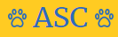

<h1 align="center">
    
</h1>

<h4 align="center">
    Esse projeto consiste em ser um site para procurar animais e também adota-los. Podemos fazer Login em nossa conta e também nos cadastrarmos, ao final dessas etapas
    é possível cadastrar o animal perdido ou divulga-lo para adoção. 
    O trabalho foi feito por 3 estudantes, sendo eu focada na parte de Front-End e Back-End e os demais ficaram responsáveis pelo deisign.
    Utilizei JavaScript junto com Firebase para fazer o acesso ao banco de dados e armazenar as informações de login e animais cadastrados. 
</h4>
 

    

 

### 🚀 Tecnologias

 Projeto desenvolvido com as seguintes tecnologias: 

- [Sass](https://sass-lang.com/)
- [SVGInject](https://github.com/iconfu/svg-inject)
- Html 5
- JavaScript
- [Firebase](https://firebase.google.com/?hl=pt)

 

 

### Vercel
Aqui você pode visualizar o projeto, é só clicar em:
[Acolher São Carlos](https://asc-two.vercel.app/)

 

 

Feito com 💖 por TamirysNogueira. [Get in Touch!](https://www.linkedin.com/in/tamirys-nogueira-346958205/)
